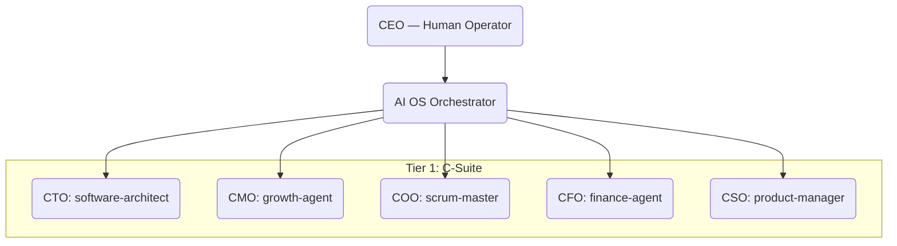

# 🏛️ AI OS CORP — Master System Index
> **Official Directory of Departments, Agents, and Workflows (Sorted by ID)**

This document serves as the definitive guide to the **21-department organizational structure** of AI OS CORP. It defines who (Agents) does what (Functions) and how they are linked (Workflows).

---

## 🏛️ 1. Executive Hierarchy (Tier 0 & 1)

The system is governed by a human-centric leadership model supported by specialized executives.

---

## 🏢 2. The Workforce Directory (Ordered by ID)

| ID | Department | Head Agent | Workers / Subagents | Primary Function |
| :--- | :--- | :--- | :--- | :--- |
| **Dept 01** | **Engineering** | `backend-architect` | `frontend-agent`, `ai-ml-agent` | Scalable Backend, Frontend UI/UX, and AI model integration. |
| **Dept 02** | **QA & Testing** | `test-manager` | `code-reviewer`, `api-tester` | Gatekeeping code quality via TDD and automated validation flows. |
| **Dept 03** | **IT Infrastructure** | `it-manager` | `devops-ops`, `nginx-commander` | Managing local DB, DNS, and Docker environments. |
| **Dept 04** | **Registry** | `registry-manager` | `attribute-manager` | Central management of the SKILL_REGISTRY and capabilities. |
| **Dept 05** | **Strategic Planning** | `product-manager` | `roadmap-architect` | Roadmap orchestration, KPI analytics, and org evolution. |
| **Dept 06** | **Finance (CFO)** | `finance-agent` | `data-analyst`, `cost-auditor` | Token budget, financial reporting, and cost management. |
| **Dept 07** | **Marketing** | `growth-agent` | `growth-hacker`, `paid-media-lead` | SEO/AEO, revenue acquisition, and brand growth. |
| **Dept 08** | **Support** | `channel-agent` | `support-analyst`, `faq-synth` | Public-facing knowledge synthesis and support tickets. |
| **Dept 09** | **Content Review** | `editor-agent` | `narrative-designer`, `copy-writer` | Final review gate for output quality and narrative tone. |
| **Dept 10** | **Strix Security** | `strix-agent` | `security-engineer`, `security-auditor` | Cyber-security auditing and vetting of external components. |
| **Dept 11** | **Legal & GRC** | `legal-agent` | `compliance-auditor` | GDPR compliance, licensing, and IP protection. |
| **Dept 12** | **HR & People** | `hr-manager` | `org-architect`, `onboarding-lead` | Agent roster management and team onboarding. |
| **Dept 13** | **Nova Research** | `rd-lead` | `web-researcher`, `academic-lead` | Deep Web research and architectural prototyping. |
| **Dept 14** | **Monitoring (SRE)** | `monitor-chief` | `sre-agent`, `incident-commander` | Real-time system health, uptime, and incident response. |
| **Dept 15** | **Org Development** | `org-architect` | `learning-agent` | System self-modification, training, and org evolution. |
| **Dept 17** | **Planning (PMO)** | `pmo-agent` | `project-shepherd`, `velocity-lead` | Project delivery tracking and milestone management. |
| **Dept 18** | **Asset Library** | `library-manager` | `archivist`, `knowledge-navigator` | Long-term memory rotation and Knowledge Graph. |
| **Dept 20** | **CIV (Content Intake)** | `intake-chief` | `repo-ingest-agent`, `doc-parser` | Systematic consumption and vetting of external content. |
| **Dept 21** | **Data & Analytics** | `data-agent` | `analytics-pro`, `kpi-reporter` | Central business intelligence and data pipeline hub. |
| **Dept 22** | **Operations** | `scrum-master` | `cleanup-daemon`, `git-protector` | Daily hardware/root sanitation and Git protection. |
| **Dept 23** | **Reception** | `project-intake` | `proposal-writer`, `brief-gatherer` | Automated client intake and project requirement parsing. |
| **Dept 24** | **Facility** | `facility-agent` | `sanitation-bot` | Maintenance of the root directory and workspace hygiene. |

---

## 🔗 3. Inter-Departmental Connections (Workflows)

### 📥 1. Intake Workflow (CIV Gate)
`External URL -> [CIV Intake] -> [Strix Security] -> [Knowledge Index]`

### 🧪 2. Development Workflow (QA Gate)
`Engineering -> [QA Testing] -> [Content Review] -> [Production]`

### 💰 3. Financial Workflow (Cost Gate)
`Task Request -> [Finance Agent] -> [Agent Activation] -> [Cost Report]`

---

## 📂 Related Resources
- **Org Chart Data**: [brain/corp/org_chart.yaml](file:///d:/AI%20OS%20CORP/AI%20OS/brain/corp/org_chart.yaml)
- **Agent Definitions**: [brain/shared-context/AGENTS.md](file:///d:/AI%20OS%20CORP/AI%20OS/brain/shared-context/AGENTS.md)

---
*End of Master Index*
