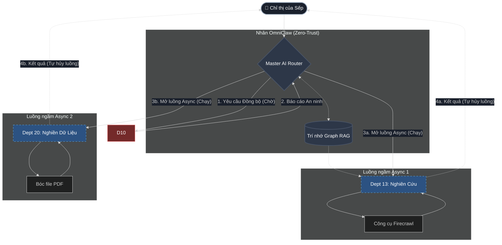

<div align="center">

  
  <h1>🦅 OmniClaw</h1>
  <b>Tập Đoàn Thu Nhỏ Tự Hành</b><br>
  <br>

  [](#)
  [](#)
  [](#)
  [](https://github.com/LongLeo287/OmniClaw/discussions)
  
  <br>
  
  🌐 **Ngôn ngữ:** [🇺🇸 English](README.md) · [🇻🇳 Tiếng Việt](README-vn.md)
  
  <br>

  [Giới thiệu](#-giới-thiệu-về-omniclaw) •
  [So sánh](#-tại-sao-chọn-omniclaw-bảng-so-sánh) •
  [Kiến trúc](#-kiến-trúc-hệ-thống) •
  [Điều phối](#-điều-phối-đa-đặc-vụ-orchestration) •
  [Hệ sinh thái](#-hệ-sinh-thái-tập-đoàn) •
  [Cài đặt](#-khởi-động-nhanh--cài-đặt) •
  [Wiki](https://github.com/LongLeo287/OmniClaw/wiki/Home-VN)

</div>

---

## 🌟 Giới thiệu về OmniClaw
**OmniClaw** là một Hệ Điều Hành đa đặc vụ (multi-agent) có tính module hóa cao, được thiết kế để chạy trực tiếp trên nền tảng của các LLM hàng đầu (Anthropic Claude, Google Gemini, OpenAI). Nó biến chiếc máy tính Local của bạn thành một tập đoàn kỹ thuật số tự trị.

Thay vì chỉ hoạt động như một chatbot thông thường, OmniClaw chủ động định tuyến các chỉ thị phức tạp của bạn qua các **Phòng Ban Chức Năng** chuyên biệt, tự quản lý trí nhớ dài hạn bằng mạng lưới Graph RAG, và liên tục tự tiến hóa mã nguồn dựa trên mệnh lệnh. Nó được thiết kế với chuẩn **Bảo mật Zero-Trust**, đảm bảo toàn bộ dữ liệu cục bộ không bao giờ bị rò rỉ ra ngoài.

---

## ⚔️ Tại sao chọn OmniClaw? (Bảng So Sánh)

OmniClaw đứng ở đâu trên bản đồ các AI Agent hiện tại? Chúng tôi xây dựng Tập đoàn này để giải quyết sự hỗn loạn của các đặc vụ phi tập trung và rủi ro bảo mật của các IDE đám mây.

| Tính năng | 🦅 OmniClaw | AutoGPT | CrewAI | Claude Code (Gốc) |
| :--- | :---: | :---: | :---: | :---: |
| **Định tuyến Nguyên khối** (Boss Agent) | 🟢 Có | 🔴 Không | 🟡 Một phần | 🟢 Có |
| **Bảo mật Dọn rác Local (Zero-Trust)** | 🟢 Tích hợp sẵn | 🔴 Không | 🔴 Không | 🟡 Thủ công |
| **Trí nhớ Đồ thị (Graph RAG)** | 🟢 Tích hợp sẵn | 🟡 Dùng Plugin | 🟡 Dùng Plugin | 🔴 Không |
| **Cỗ máy Khởi động Đa năng** | 🟢 Có | 🔴 Không | 🔴 Không | 🔴 Không |
| **Giao thức Plugin 3 Lớp (Hộp cát)** | 🟢 Nghiêm ngặt | 🔴 Hỗn loạn | 🟡 Cơ bản | 🔴 Không |
| **Đa nền tảng** (Cursor, VSCode, CLI) | 🟢 Có | 🟡 Chỉ CLI | 🟡 Chỉ CLI | 🟡 Đa số là CLI |

---

## 🏛️ Kiến Trúc Hệ Thống

OmniClaw được xây dựng trên thiết kế nguyên khối (Monolithic) dạng Trục-và-Nan-hoa (Hub-and-Spoke). Mọi yêu cầu đều phải chảy qua Master AI Router, đảm bảo không có đặc vụ nào được phép tự ý thực thi mã nguồn mà không có sự cho phép.

<div align="center">

  
  <br><i>Hình 1: Kiến trúc Nguyên khối Zero-Trust của OmniClaw</i>

</div>

---

## 🧠 Điều Phối Đa Đặc Vụ (Orchestration)

OmniClaw ngăn chặn sự hỗn loạn của các AI Agent bằng cách áp đặt một mô hình giao tiếp nghiêm ngặt. Các phòng ban không chat trực tiếp với nhau; chúng chỉ giao tiếp thông qua Master AI Router trung tâm hoặc bằng cách đọc/ghi vào Trí nhớ chung (Graph RAG).


<div align="center">
  <i>Hình 2: Luồng Điều phối Nguyên khối của Tập đoàn OmniClaw</i>
</div>
<br>

### Chế Độ Ủy Quyền (Delegation Modes)

| Chế độ | Cách hoạt động | Phù hợp cho |
| :--- | :--- | :--- |
| **Đồng bộ (Sync)** | Master Router giao việc cho Phòng ban và dừng lại chờ đến khi có kết quả trả về. | Tra cứu nhanh, Rà soát bảo mật (Dept 10), Kiểm tra cú pháp. |
| **Bất đồng bộ (Async)** | Master Router mở luồng chạy ngầm cho Phòng ban và tiếp tục làm việc khác. | Nuốt file PDF khổng lồ (Dept 20), Cào dữ liệu Deep Web (Dept 13). |

### Luồng Phối Hợp Của Tập Đoàn

Khác với các framework đa đặc vụ thông thường (nơi các agent tự do chat qua lại với nhau), OmniClaw ép buộc một luồng làm việc chuẩn doanh nghiệp:
* **Trí nhớ Đồ thị Dùng chung (Graph RAG):** Các phòng ban không chat trực tiếp. Chúng đọc và ghi các Điểm Tri Thức (Knowledge Items) vào cơ sở dữ liệu Graph trung tâm.
* **Bàn giao Zero-Trust:** Dữ liệu truyền giữa các Phòng ban bị kiểm duyệt gắt gao. Ví dụ: Dept 20 phải ép các file PDF nặng thành định dạng Markdown thuần túy trước khi Dept 13 được phép đọc, nhằm chặn đứng mọi mã độc tiêm nhiễm.
* **Khóa Cấp độ Phần cứng:** Chỉ duy nhất Dept 22 (Vận Hành) được cấp quyền chạy lệnh Terminal hoặc thao tác Git. Toàn bộ các đặc vụ khác bị nhốt chặt trong hộp cát (sandbox).

### Giao thức Plugin 3 Lớp
Để duy trì sự nhẹ bén cốt lõi nhưng vẫn có khả năng mở rộng sức mạnh vô hạn, toàn bộ công cụ trong OmniClaw tuân thủ nghiêm ngặt **Giao thức Plugin 3 Lớp**:
*   **Tier 1 (Hạ tầng Lõi)**: Các động cơ chạy ngầm, luôn bật (vd: `LightRAG`, `Firecrawl`).
*   **Tier 2 (Lazy-Load Plugin)**: Các công cụ đặc thù được đưa vào hộp cát (Sandbox). Chúng **chỉ được tải vào RAM khi có lệnh gọi**, sau đó tự động bị tiêu hủy để giải phóng bộ nhớ.
*   **Tier 3 (Danh sách đen)**: Các module lỗi thời hoặc xung đột (Bị cấm chạy tuyệt đối).

---

## 🏢 Hệ Sinh Thái Tập Đoàn

Chỉ thị từ Sếp (CEO) sẽ được định tuyến qua lực lượng lao động nội bộ. OmniClaw hiện vận hành **21 phòng ban chuyên biệt**. Dưới đây là bảng tóm tắt các đơn vị nòng cốt:

| Mã PB | Phân Loại | Chức Năng Cốt Lõi | Quyền Hạn | Đặc Vụ Trưởng |
| :--- | :--- | :--- | :--- | :--- |
| **Dept 01** | `Kỹ Thuật` | Phát triển Backend, UI/UX, tích hợp AI. | `Đọc/Ghi Local` | `backend-architect` |
| **Dept 10** | `An Ninh` | Quét Git Zero-Trust, dọn dẹp biến môi trường. | `Root Local` | `strix-agent` |
| **Dept 13** | `Nghiên Cứu` | Cào dữ liệu Web sâu, phác thảo kiến trúc. | `Truy cập Web` | `rd-lead` |
| **Dept 18** | `Trí Nhớ` | Quản lý luân chuyển Trí nhớ & Graph RAG. | `Chỉ Đọc Local` | `library-manager` |
| **Dept 20** | `Nghiền Dữ Liệu` | Xử lý file PDF/URLs khổng lồ sang Markdown. | `Hộp cát Kín`| `intake-chief` |
| **Dept 22** | `Vận Hành` | Dọn rác phần cứng, chặn Git Force-Push. | `Root Local` | `scrum-master` |

> [!TIP]
> **Đọc Thêm**: Để xem toàn bộ danh sách 21 phòng ban và phân quyền công cụ, vui lòng truy cập an toàn vào **[Danh Mục Hệ Thống trên Wiki](https://github.com/LongLeo287/OmniClaw/blob/main/brain/corp/MASTER_INDEX-vn.md)**.

---

## ⚡ Khởi Động Nhanh & Cài Đặt

OmniClaw cung cấp một Cỗ máy Khởi động Đa năng (Universal Bootstrapper). Hãy chọn phương pháp phù hợp nhất với luồng công việc của bạn.

### Cách A: Cài đặt Toàn cầu (Khuyên dùng)
Tốt nhất cho những ai muốn gọi OmniClaw từ bất kỳ thư mục nào trên máy tính.

```bash
# 1. Tải lõi hệ điều hành và di chuyển vào thư mục
git clone https://github.com/LongLeo287/OmniClaw.git && cd OmniClaw

# 2. Cài đặt liên kết toàn cầu (Global) qua NPM
npm install -g .

# 3. Khởi động Terminal của Tập đoàn (Chạy từ bất cứ đâu)
omniclaw
```

### Cách B: Cài đặt Độc lập (Windows / Linux)
Tốt nhất cho các dự án cần sự cô lập, không muốn thay đổi biến môi trường (paths) của máy.

```bash
# 1. Tải lõi hệ điều hành và di chuyển vào thư mục
git clone https://github.com/LongLeo287/OmniClaw.git && cd OmniClaw

# 2. Chạy trực tiếp script khởi động
# Trên Linux/Mac:
./omniclaw.sh

# Trên Windows (Hoặc nhấp đúp thẳng vào file trong thư mục):
omniclaw.bat
```

---

## 📚 Wiki Chính Thức & Trạm Tri Thức

Toàn bộ tài liệu phân tích kiến trúc sâu, các tiêu chuẩn vận hành phòng ban (SOPs), và hướng dẫn cho lập trình viên đều được lưu trữ nghiêm ngặt trên GitHub Wiki để giữ cho thư mục gốc sạch sẽ nhất.

**[➡️ Bước vào Trạm Tri Thức OmniClaw (Tiếng Việt)](https://github.com/LongLeo287/OmniClaw/wiki/Home-VN)**

* 🏛️ [Kiến Trúc Nguyên Khối (Monolithic OS Design)](https://github.com/LongLeo287/OmniClaw/wiki/Monolithic-OS-Design-VN)
* 🧠 [Hệ Thống Trí Nhớ (Cognitive Memory)](https://github.com/LongLeo287/OmniClaw/wiki/Cognitive-Memory-VN)
* 🛡️ [Lá Chắn Không Gian & Quy Trình Hủy Diệt](https://github.com/LongLeo287/OmniClaw/wiki/Zero-Trust-Model-VN)

---

## 🙏 Lời Cảm Ơn

OmniClaw đứng trên vai những người khổng lồ của thế giới mã nguồn mở. Chúng tôi gửi lời tri ân sâu sắc tới:

*   **[Anthropic](https://anthropic.com)**: Cho công cụ Claude Code CLI với cấu trúc REPL tuyệt đỉnh.
*   **[Google Deepmind](https://deepmind.google.com/technologies/gemini/)**: Với dòng Model Gemini có khả năng phân tích ngữ cảnh siêu việt.
*   **[affaan-m / everything-claude-code](https://github.com/affaan-m/everything-claude-code)**: Thiết lập lá chắn bảo mật Đặc vụ đa nền tảng.
*   **[LightRAG](https://github.com/HKUDS/LightRAG)**: Cung cấp động cơ truy xuất trí nhớ đồ thị siêu tốc.
*   **[Firecrawl](https://firecrawl.dev)**: Vận hành cỗ máy bóc tách dữ liệu web sang markdown.
*   **[Mem0](https://github.com/mem0ai/mem0)**: Tạo nên cuộc cách mạng trong lưu trữ trí nhớ dài hạn.
*   **[CrewAI](https://crewai.com)**: Tạo cảm hứng cho mạng lưới phòng ban tự trị.
*   **[Cursor](https://cursor.sh)** / **OpenCode**: Các môi trường IDE hàng đầu của chúng tôi.

<br>
<div align="center">
  <i>"Hệ Điều Hành Của Tương Lai, Đang Chạy Ngay Trên Bàn Làm Việc Của Bạn."</i>
</div>
