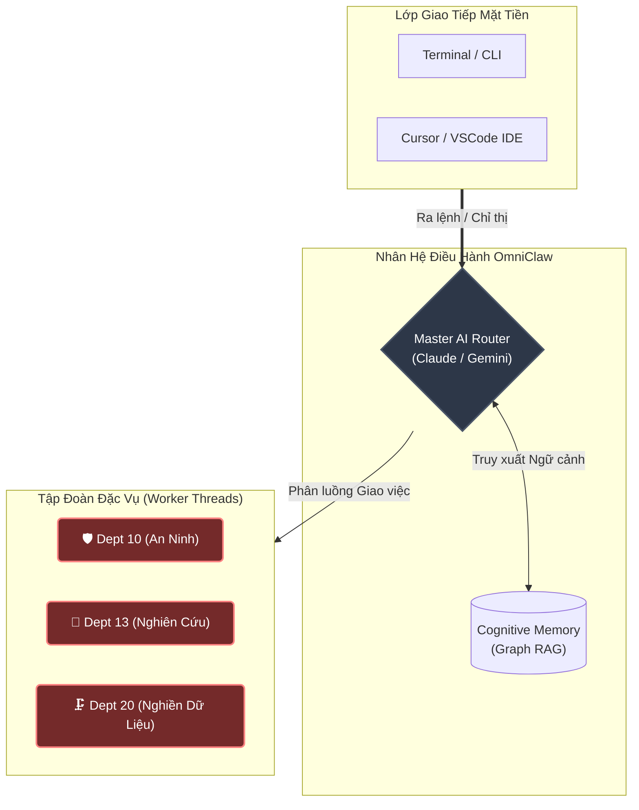

<div align="center">
  
  <h1>🦅 OmniClaw</h1>
  <b>Tập Đoàn Thu Nhỏ Tự Hành</b><br>
  <br>

  [](#)
  [](#)
  [](#)
  [](https://github.com/LongLeo287/aios-local/discussions)
  
  <br>
  
  [**View English Version**](README.md)
  
  <br>

  [Giới thiệu](#-giới-thiệu-về-omniclaw) •
  [Sức mạnh](#-sức-mạnh-cốt-lõi--tại-sao-chọn-omniclaw) •
  [Kiến trúc](#-kiến-trúc--giao-thức-plugin-3-lớp) •
  [Phòng ban](#-nhân-sự-các-phòng-ban-cốt-lõi) •
  [Tài liệu](#-wiki-chính-thức--trạm-tri-thức) •
  [Cài đặt](#-cài-đặt) •
  [Lời cảm ơn](#-lời-cảm-ơn)

</div>

---

## 🌟 Giới thiệu về OmniClaw
**OmniClaw** là một Hệ Điều Hành đa đặc vụ (multi-agent) có tính module hóa cao, được thiết kế để chạy trực tiếp trên nền tảng của các LLM hàng đầu (Anthropic Claude, Google Gemini, OpenAI). Nó biến chiếc máy tính Local của bạn thành một tập đoàn kỹ thuật số tự trị.

Thay vì chỉ hoạt động như một chatbot thông thường, OmniClaw chủ động định tuyến các chỉ thị phức tạp của bạn qua các **Phòng Ban Chức Năng** chuyên biệt, tự quản lý trí nhớ dài hạn bằng mạng lưới Graph RAG, và liên tục tự tiến hóa mã nguồn dựa trên mệnh lệnh. Nó được thiết kế với chuẩn **Bảo mật Zero-Trust**, đảm bảo toàn bộ dữ liệu cục bộ không bao giờ bị rò rỉ ra ngoài.

---

## ⚡ Sức mạnh cốt lõi & Tại sao chọn OmniClaw?

Điều gì làm nên sự khác biệt hoàn toàn giữa OmniClaw và các trợ lý AI thông thường?

1. **Tính Di Động & Đa Nền Tảng Tuyệt Đối**
   Chúng tôi không nhốt bạn vào một hệ sinh thái IDE duy nhất. OmniClaw được thiết kế để tương thích với **Cursor**, **Claude Code CLI**, **Google Gemini**, và **OpenCode**. Các quy tắc hệ thống được kế thừa đồng nhất dù bạn dùng giao diện nào để ra lệnh.
2. **Bảo Vệ Git Bằng Zero-Trust**
   Được trang bị các Daemon ngầm `omniclaw_cleaner.py` cực kỳ quyết liệt. Mỗi khi bạn đóng phiên làm việc, Hệ điều hành sẽ quét dọn bộ nhớ tạm, xóa các database ẩn (`.sqlite`, `.db`), và cắt xén lịch sử commit GitHub để đảm bảo API Keys hoặc mật khẩu không bao giờ lọt ra khỏi ổ cứng của bạn.
3. **Cỗ Máy Khởi Động Đa Năng (Universal Bootstrapper)**
   Quên đi việc phải tự cấu hình hàng tá shell script. Chỉ cần gõ lệnh `omniclaw` trong Terminal (hoặc nhấp đúp file `omniclaw.bat` trên Windows) để mở ngay Bảng điều khiển trung tâm. Nó sẽ tự động xử lý các thư viện NPM, tiêm (inject) Extension vào VSCode và định tuyến Model.
4. **Thực Thi Tự Trị (Worker Threads)**
   Các Master Agent (như Claude/Gemini) sẽ đóng vai trò ủy quyền các siêu nhiệm vụ nhiều bước cho các Đặc vụ con (CrewAI, Node scripts). Nó đóng vai trò là một Giám đốc dự án, chứ không chỉ là một thợ gõ code.

---

## 🗺️ Kiến trúc & Giao thức Plugin 3 Lớp

Để duy trì sự nhẹ bén cốt lõi nhưng vẫn có khả năng mở rộng sức mạnh vô hạn, toàn bộ công cụ trong OmniClaw tuân thủ nghiêm ngặt **Giao thức Plugin 3 Lớp**:

*   **Tier 1 (Hạ tầng Lõi)**: Các động cơ chạy ngầm, luôn bật (vd: `LightRAG` quản lý trí nhớ, `Firecrawl` để cào dữ liệu web sâu).
*   **Tier 2 (Lazy-Load Plugin)**: Các công cụ đặc thù (như bóc tách PDF, render ảnh nặng bằng Python) được đưa vào hộp cát (Sandbox). Chúng **chỉ được tải vào RAM khi có lệnh gọi**, sau đó tự động bị tiêu hủy để giải phóng bộ nhớ.
*   **Tier 3 (Danh sách đen)**: Các module lỗi thời hoặc xung đột, bị hệ thống cấm chạy tuyệt đối để tránh rò rỉ dữ liệu.



---

## 🏢 Nhân sự (Các Phòng Ban Cốt Lõi)

Chỉ thị từ Sếp (CEO) sẽ được định tuyến qua các phòng ban chuyên biệt. Hệ điều hành hiện chứa **21 phòng ban** được tổ chức thành 5 khối chức năng.

| ID | Phòng Ban | Chức Năng Cốt Lõi | Đặc Vụ Trưởng |
| :--- | :--- | :--- | :--- |
| **Dept 01** | **Kỹ Thuật (Engineering)** | Phát triển Backend mở rộng, Frontend UI/UX, tích hợp AI. | `backend-architect` |
| **Dept 05** | **Hoạch Định Chiến Lược** | Quản lý tiến độ, phân tích KPI và tiến hóa hệ thống. | `product-manager` |
| **Dept 09** | **Kiểm Duyệt Nội Dung** | Cổng rà soát cuối cùng về chất lượng code và văn phong. | `editor-agent` |
| **Dept 10** | **An Ninh (Strix Security)** | Rà soát lỗ hổng bảo mật và kiểm tra các mã nguồn từ bên ngoài. | `strix-agent` |
| **Dept 13** | **Nghiên Cứu (Nova Research)** | Cào dữ liệu Deep Web và phác thảo kiến trúc nguyên mẫu. | `rd-lead` |
| **Dept 18** | **Thư Viện Tài Sản** | Quản lý luân chuyển Trí nhớ và Khối dữ liệu Graph RAG. | `library-manager` |
| **Dept 20** | **Nghiền Dữ Liệu (CIV)** | Tự động nuốt các file PDF, URLs khổng lồ và ép thành chuẩn Markdown. | `intake-chief` |
| **Dept 22** | **Vận Hành (Operations)** | Dọn dẹp phần cứng, dọn rác root và bảo vệ thao tác Git Force-Push. | `scrum-master` |
| **Dept 23** | **Tiếp Tân (Reception)** | Tự động tiếp nhận yêu cầu, gom brief và lên báo cáo tổng quan. | `project-intake` |

> [!TIP]
> **Đọc Thêm**: Để giữ cho thư mục gốc sạch sẽ và không có rác, danh sách đầy đủ toàn bộ 21 phòng ban và luồng tương tác đã được di dời an toàn lên Wiki. Vui lòng truy cập **[Danh Mục Hệ Thống trên Wiki](https://github.com/LongLeo287/aios-local/wiki)**.

---

## 📚 Wiki Chính Thức & Trạm Tri Thức

Toàn bộ tài liệu phân tích kiến trúc sâu, các tiêu chuẩn vận hành phòng ban (SOPs), và hướng dẫn cho lập trình viên đều được lưu trữ trên GitHub Wiki của chúng tôi.

**[➡️ Bước vào Trạm Tri Thức OmniClaw (Tiếng Việt)](https://github.com/LongLeo287/aios-local/wiki/Home-VN)**

**Tài Liệu Nổi Bật:**
* 🏛️ [Kiến Trúc Nguyên Khối (Monolithic OS Design)](https://github.com/LongLeo287/aios-local/wiki/Monolithic-OS-Design-VN)
* 🧠 [Hệ Thống Trí Nhớ (Cognitive Memory)](https://github.com/LongLeo287/aios-local/wiki/Cognitive-Memory-VN)
* 🛡️ [Lá Chắn Không Gian & Quy Trình Hủy Diệt](https://github.com/LongLeo287/aios-local/wiki/Zero-Trust-Model-VN)

---

## 💽 Cài đặt

OmniClaw được xây dựng theo chuẩn "Clone & Run" cực kỳ tối giản.

```bash
# 1. Tải lõi hệ điều hành về máy cục bộ
git clone [https://github.com/LongLeo287/aios-local.git](https://github.com/LongLeo287/aios-local.git) "omniclaw"
cd "omniclaw"

# 2. Cài đặt liên kết toàn cầu (Global) qua NPM
npm install -g .

# 3. Khởi động Cỗ máy Nguyên khối (Có thể chạy lệnh này ở bất kỳ đâu)
omniclaw
```

*Mẹo cho Windows: Chúng tôi cung cấp trải nghiệm thao tác một chạm. Chỉ cần nhấp đúp chuột vào file `omniclaw.bat` nằm ở thư mục gốc để mở ngay lập tức Bảng điều khiển.*

---

## 🌐 Cộng Đồng & Hỗ Trợ

Sếp có ý tưởng, thắc mắc, hay muốn khoe các luồng Đặc vụ tự tạo? Chúng tôi đã xây dựng một không gian riêng biệt để lực lượng kỹ sư OmniClaw giao lưu.

**[🚀 Tham gia Không gian Thảo luận của OmniClaw](https://github.com/LongLeo287/aios-local/discussions)**

---

## 🙏 Lời Cảm Ơn

OmniClaw đứng trên vai những người khổng lồ của thế giới mã nguồn mở. Chúng tôi gửi lời tri ân sâu sắc tới các tổ chức và dự án sau:

*   **[Anthropic](https://anthropic.com)**: Cho công cụ Claude Code CLI với cấu trúc REPL tuyệt đỉnh.
*   **[Google Deepmind](https://deepmind.google.com/technologies/gemini/)**: Với dòng Model Gemini có khả năng phân tích ngữ cảnh sâu và dài hiếm có.
*   **[affaan-m / everything-claude-code](https://github.com/affaan-m/everything-claude-code)**: Với quy trình thiết lập lớp lá chắn bảo mật Đặc vụ và phân quyền dựa trên Role cực hay.
*   **[LightRAG](https://github.com/HKUDS/LightRAG)**: Cung cấp động cơ truy xuất trí nhớ đồ thị siêu tốc và chính xác.
*   **[Firecrawl](https://firecrawl.dev)**: Vận hành cỗ máy ép và chuyển đổi dữ liệu web sang markdown hoàn hảo.
*   **[Mem0](https://github.com/mem0ai/mem0)**: Tạo nên cuộc cách mạng trong việc lưu trữ trí nhớ dài hạn cho AI.
*   **[CrewAI](https://crewai.com)**: Tạo cảm hứng cho mạng lưới phân chia phòng ban và đặc vụ con cực kỳ logic.
*   **[Cursor](https://cursor.sh)** / **OpenCode**: Các môi trường IDE hàng đầu, tạo nên liên kết thần kinh hoàn hảo giữa Hệ điều hành và CEO.

<br>
<div align="center">
  <i>"Hệ Điều Hành Của Tương Lai, Đang Chạy Ngay Trên Bàn Làm Việc Của Bạn."</i>
</div>
