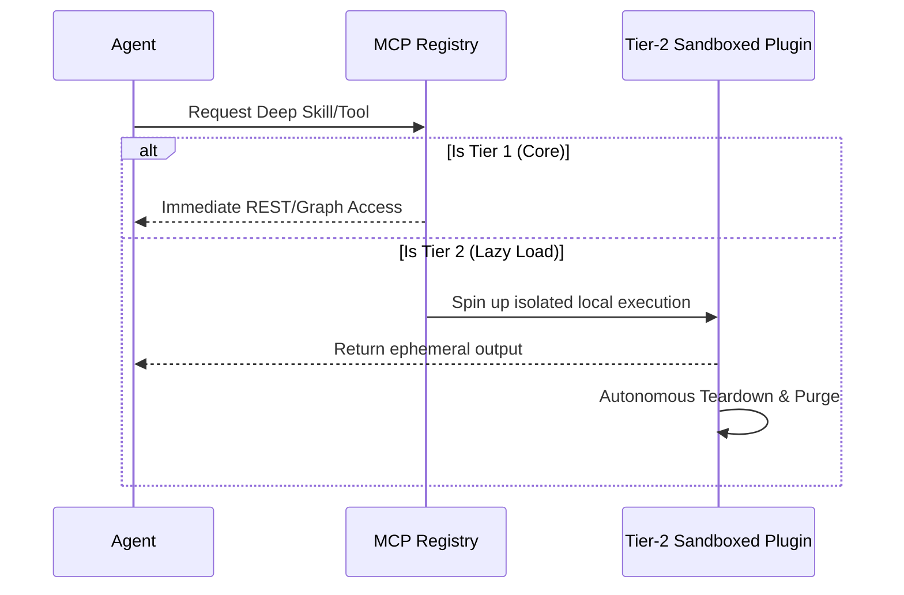

<div align="center">
  
  <h1>🌌 AI OS CORP</h1>
  <b>The Autonomous, Monolithic Multi-Agent Operating System</b><br>
  <br>

  [](#)
  [](#)
  [](#)
  [](https://github.com/LongLeo287/aios-local/discussions)
  
  <br>
  
  [**🇻🇳 Xem Phiên Bản Tiếng Việt (Vietnamese)**](README-vn.md)
  
  <br>

  [About](#-about-ai-os) •
  [Strengths](#-core-strengths--why-ai-os) •
  [Architecture](#-architecture--3-tier-plugins) •
  [Departments](#-the-workforce-departments) •
  [Installation](#-installation) •
  [Discussions](https://github.com/LongLeo287/aios-local/discussions) •
  [Credits](#-acknowledgements)

</div>

---

## 🌟 About AI OS
**AI OS CORP** is a highly modular, multi-agent Operating System designed to run directly on top of premier LLMs (Anthropic Claude, Google Gemini, OpenAI). It transforms your local machine into an autonomous digital corporation. 

Rather than acting as a simple chatbot, AI OS actively routes your complex directives through specialized **Functional Departments**, manages its own memory utilizing Graph RAG, and dynamically evolves its codebase based on your instructions. It is designed with **Zero-Trust Privacy**, ensuring all your local data remains strictly on your machine.

---

## ⚡ Core Strengths & Why AI OS?

What makes AI OS profoundly different from standard AI coding assistants?

1. **Absolute Portability & Platform Agnosticism**
   We do not lock you into a single IDE. AI OS is designed from the ground up to be compatible with **Cursor**, **Claude Code CLI**, **Google Gemini**, and **OpenCode**. The systemic rules are globally inherited no matter which frontend you prefer.
2. **Zero-Trust Git Protection**
   Equipped with aggressive post-session `aios_deep_cleaner.py` background daemons. Every time you close a session, the OS sweeps your cache, purges ephemeral databases (`.sqlite`, `.db`), and sanitizes GitHub commits to prevent API keys or secrets from ever leaving your local drive.
3. **Hyper-Automated Universal Bootstrapper**
   Forget managing 10 different shell scripts. Simply run `aios` in your terminal (or double-click the Windows `aios.bat`) to instantly invoke the central Dashboard. It handles NPM dependencies, VSCode Extension injections, and Model routing automatically.
4. **Autonomous Execution (Worker Threads)**
   Master agents (like Claude or Gemini) delegate massive, multi-step tasks to sub-agents (CrewAI, Node scripts). It acts as a Project Manager, not just a programmer.

---

## 🗺️ Architecture & 3-Tier Plugins

To maintain a lightweight footprint while offering infinite vertical scaling, all tools in AI OS follow a strict **3-Tier Plugin Protocol**:

*   **Tier 1 (Core Infrastructure)**: Native, always-on engines (e.g., `LightRAG` for memory, `Firecrawl` for deep web scraping).
*   **Tier 2 (Lazy-Load Plugins)**: Specialized tools (like PDF parsers or heavy Python image generators) that are sandboxed and **spun up only when requested**, then autonomously destroyed/detached to free up RAM.
*   **Tier 3 (Blacklisted)**: Outdated or conflicting legacy modules that the system is strictly forbidden from executing.



---

## 🏢 The Workforce (Core Departments)

Directives from the CEO (You) are routed through specialized departments. The OS contains **21 total departments** organized across 5 functional clusters.

| ID | Department | Function | Head Agent |
| :--- | :--- | :--- | :--- |
| **Dept 01** | **Engineering** | Scalable Backend, Frontend UI/UX, and AI model integration. | `backend-architect` |
| **Dept 05** | **Strategic Planning** | Roadmap orchestration, KPI analytics, and org evolution. | `product-manager` |
| **Dept 09** | **Content Review** | Final review gate for output quality and narrative tone. | `editor-agent` |
| **Dept 10** | **Strix Security** | Cyber-security auditing and vetting of external components. | `strix-agent` |
| **Dept 13** | **Nova Research** | Deep Web research and architectural prototyping. | `rd-lead` |
| **Dept 18** | **Asset Library** | Managing Memory Rotation and the comprehensive Knowledge Graph. | `library-manager` |
| **Dept 20** | **CIV (Content Intake)** | Systematically consumes, scrapes, and parses massive GitHub URLs or PDFs into pure Markdown. | `intake-chief` |
| **Dept 22** | **Operations** | Hardware sanitation, root directory cleanup, and Git Force-Push protection. | `scrum-master` |
| **Dept 23** | **Reception** | Automated client intake, brief collection, and proposal generation. | `project-intake` |

> [!TIP]
> **Deep Dive**: For the full breakdown of all 21 departments, reporting lines, and agent interactions, see the [**Master System Index**](brain/corp/MASTER_INDEX.md).

> [!NOTE]
> For the full list of 21 departments and agent rosters, please refer to the `brain/corp/org_chart.yaml` master registry.

---

## 💽 Installation

AI OS is built to be a simple "Clone & Run" architecture.

```bash
# 1. Clone the core repository to your local drive
git clone https://github.com/LongLeo287/aios-local.git "AI OS"
cd "AI OS"

# 2. Link the Global System via NPM
npm install -g .

# 3. Boot the Monolithic OS Terminal (Can be run from anywhere)
aios
```

*Windows Tip: We have provided native Windows GUI accessibility. Simply double-click the `aios.bat` script located in the root repository to instantaneously open the Control Dashboard.*

---

## 🌐 Community & Support

Have ideas, questions, or want to showcase your custom Agent workflows? We have built a dedicated space for the AI OS workforce to collaborate.

**[🚀 Step into the AI OS CORP Discussions Space](https://github.com/LongLeo287/aios-local/discussions)**

---

## 🙏 Acknowledgements

AI OS CORP stands upon the shoulders of monumental open-source architectures. We deeply thank and credit the following repositories and organizations:

*   **[Anthropic](https://anthropic.com)**: For the Claude Code CLI and its phenomenal REPL structure.
*   **[Google Deepmind](https://deepmind.google.com/technologies/gemini/)**: For the Gemini models and their unprecedented deep-context structural analysis.
*   **[affaan-m / everything-claude-code](https://github.com/affaan-m/everything-claude-code)**: For their phenomenal cross-platform Agent shielding workflows and role-based instruction patterns.
*   **[LightRAG](https://github.com/HKUDS/LightRAG)**: Supplying the immense and precise Graph-based cognitive retrieval system.
*   **[Firecrawl](https://firecrawl.dev)**: Powering the flawless markdown extraction pipeline.
*   **[Mem0](https://github.com/mem0ai/mem0)**: Revolutionizing long-term memory persistence for AI agents.
*   **[CrewAI](https://crewai.com)**: Inspiring the localized worker-thread and sub-agent hive network.
*   **[Cursor](https://cursor.sh)** / **OpenCode**: Our IDE environments of choice, facilitating the neural link between the OS and the CEO.

<br>
<div align="center">
  <i>"The Operating System of the Future, Running on Your Desk Today."</i>
</div>
