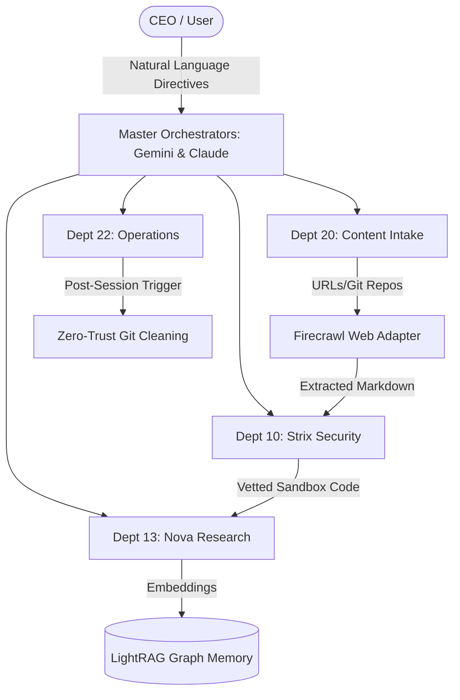
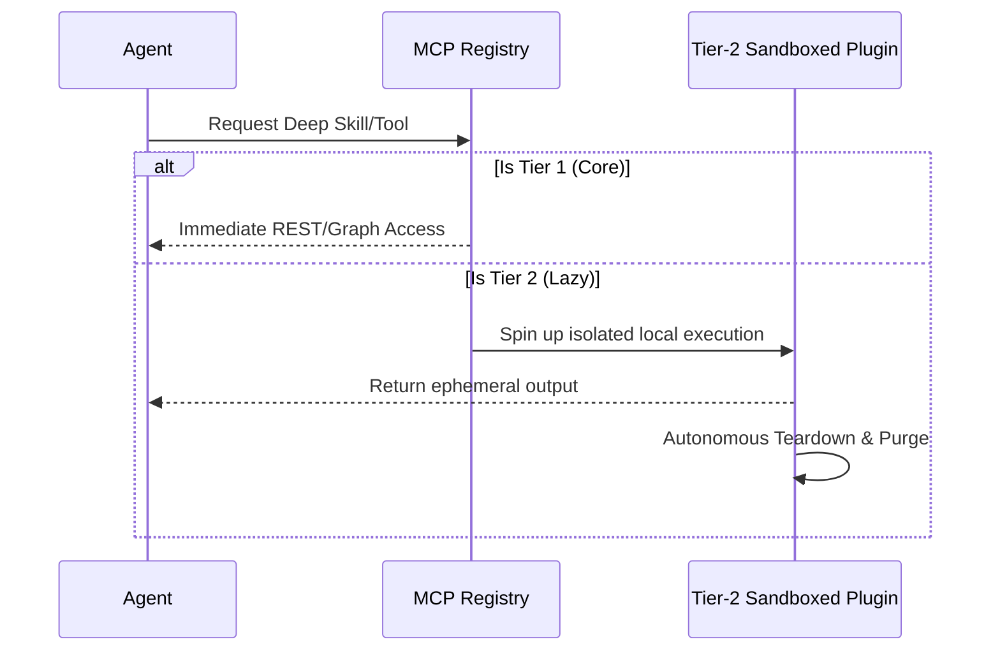
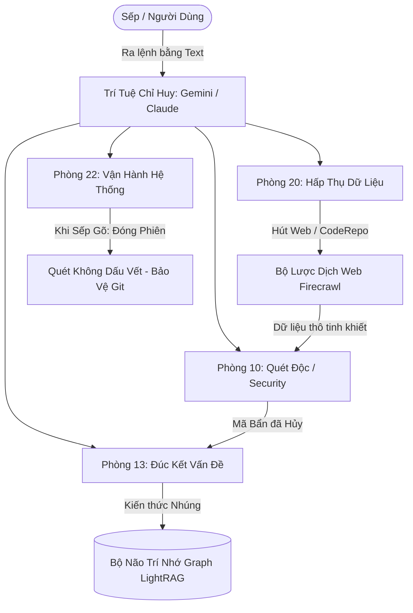
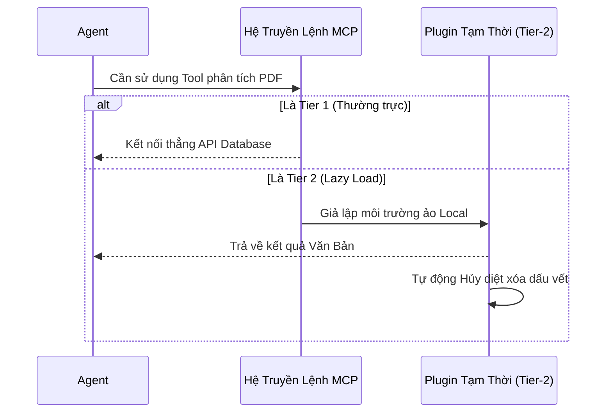

<div align="center">
  <h1>🌌 AI OS CORP</h1>
  <b>The Autonomous, Monolithic Multi-Agent Operating System</b><br>
  <i>(Hệ Điều Hành Đa Đặc Vụ Tự Trị Dạng Nguyên Khối)</i>
  <br><br>
  <a href="#english">🇺🇸 English Version</a> &nbsp; | &nbsp; <a href="#vietnamese">🇻🇳 Phiên bản Tiếng Việt</a>
  <br><br>
  
  
  
</div>

---

<a id="english"></a>
# 🇺🇸 English Version

## 📑 Table of Contents (Tab Menu)
1. [🌟 Introduction](#introduction)
2. [⚡ What's Inside (Feature Matrix)](#features)
3. [🗺️ Architecture & Diagrams](#architecture)
4. [💽 Installation & Guide](#installation)
5. [🙏 Credits & Acknowledgements](#credits)

<a id="introduction"></a>
## 1. 🌟 Introduction
**AI OS CORP** is a multi-agent, highly modular Operating System designed natively to operate over top-tier LLMs (Anthropic Claude, Google Gemini, OpenAI). It is engineered to perform as an autonomous digital corporation on your local machine.

AI OS routes complex directives through functional departments, strictly guards your local privacy using a Zero-Trust local cache shielding layer, and dynamically patches/evolves its own codebase based on the CEO's (Your) conversational iterations.

<a id="features"></a>
## 2. ⚡ What's Inside (The Ecosystem)
The OS is a living organism of integrated AI components. Here is an exhaustive matrix of the system runtime:
- **Agentic AI & Co-Work**: Master agents (Antigravity/Claude) delegate granular tasks to specialized sub-agents and worker threads in an autonomous, baton-passing sequence.
- **Corporate Departments**: 
  - *Dept 10 (Strix)*: Cyber-Security & Code Auditing.
  - *Dept 13 (Nova)*: Fundamental Architecture & Deep Research.
  - *Dept 20 (CIV)*: Content Intake & Repository Ingestion.
  - *Dept 22 (Ops)*: System Sanitation & Operations.
- **Plugins (3-Tier Protocol)**:
  - *Tier 1 (Core)*: Uninterrupted infrastructure (LightRAG, Firecrawl).
  - *Tier 2 (Lazy Load)*: Sandboxed tools spun up on-demand, destroyed after use.
  - *Tier 3 (Blacklisted)*: Quarantined experimental modules.
- **Model Context Protocol (MCP)**: Native servers integrating live data (Context7, Google Developer Docs, Supabase, StitchMCP) directly into the AI's cognitive loop.
- **Micro-Skills Ecosystem**: Read-eval-execute subroutines (`react:components`, `stitch-design`) pre-coded for instantaneous frontend/backend generations.
- **Core LLMs**: Optimized out-of-the-box for **Gemini 2.5 Pro**, **Claude 3.7 Sonnet**, and fully compatible with offline `Ollama` models serving as air-gapped fallbacks.
- **Hyper-Automation**: Systemic pipelines autonomously orchestrate the Language Environment Setup, Node.js NPM bootstraps, Git exclusion routines, and physical Deep Cache Cleanses post-session.

<a id="architecture"></a>
## 3. 🗺️ Architecture & Diagrams

### Corporate Department Flow


### 3-Tier Plugin & MCP Lazy Loading


<a id="installation"></a>
## 4. 💽 Installation & Guide
```bash
# 1. Clone the core repository to your local drive
git clone https://github.com/LongLeo287/aios-local.git "AI OS"
cd "AI OS"

# 2. Global System Installation via NPM
npm install -g .

# 3. Boot the Monolithic OS Terminal (Can run from any path)
aios
```
*Windows Tip: We have provided native Windows accessibility. Double-click the `aios.bat` script located in the root repository to instantaneously open the Dashboard Launcher.*

<a id="credits"></a>
## 5. 🙏 Credits & Acknowledgements
AI OS CORP stands upon the shoulders of monumental open-source architectures. We deeply thank and credit the following repositories and organizations:
- **Anthropic / Claude Code CLI**: Providing the foundational Terminal REPL and Agentic execution parameters.
- **Google / Gemini & Antigravity**: Providing unprecedented deep-context structural analysis and code-generation.
- **[affaan-m / everything-claude-code](https://github.com/affaan-m/everything-claude-code)**: For their phenomenal cross-platform Agent shielding workflows and role-based instruction patterns.
- **LightRAG**: Supplying the immense and precise Graph-based cognitive retrival system.
- **Firecrawl**: Powering the flawless markdown extraction pipeline.
- **CrewAI**: Inspiring the localized worker-thread and sub-agent hive network.
- **Cursor / OpenCode**: Our IDE environments of choice, facilitating the neural link between the OS and the CEO.

---

<br><br><br>

<a id="vietnamese"></a>
# 🇻🇳 Phiên Bản Tiếng Việt

## 📑 Danh Mục (Menu Trình Đơn)
1. [🌟 Giới thiệu](#vn_introduction)
2. [⚡ Hệ sinh thái có những gì?](#vn_features)
3. [🗺️ Sơ đồ Kiến trúc & Quy trình](#vn_architecture)
4. [💽 Hướng dẫn Cài đặt](#vn_installation)
5. [🙏 Lời Cảm ơn & Nguồn](#vn_credits)

<a id="vn_introduction"></a>
## 1. 🌟 Giới Thiệu
**AI OS CORP** là một Hệ Điều Hành Đa Đặc Vụ (Multi-Agent Operating System) được thiết kế nguyên khối. Dự án mang lại khả năng biến chiếc máy tính Local của bạn thành một Tập Đoàn Kỹ Thuật Số hoạt động tự trị—nơi các Bộ Não AI siêu việt (Claude, Gemini) tự động phân luồng công việc, điều hành các phòng ban chức năng chuyên biệt, bảo vệ bảo mật tuyệt đối dữ liệu nội bộ và đặc biệt: Tự tiến hóa (Viết thêm mã lệnh, quy trình) sau mỗi cuộc đối thoại với Giám đốc (CEO - Người dùng).

<a id="vn_features"></a>
## 2. ⚡ Hệ Sinh Thái Có Những Gì? (Features Matrix)
Hệ điều hành AI OS không chỉ là một vỏ bọc, nó là một quần thể sinh thái được chia nhỏ đến từng linh kiện:
- **Agentic AI & Subagents (Cơ Chế Phân Việt)**: Các Agent tổng tư lệnh (Antigravity/Claude) không làm mọi việc. Thay vào đó, chúng tự chia nhỏ tác vụ và uỷ nhiệm cho các Đặc vụ con (Sub-agents / CrewAI) để song song giải quyết vấn đề.
- **Phòng Ban Hệ Thống (Departments)**: 
  - *Dept 10 (Strix)*: Đội an ninh mạng, rà soát mã độc trước khi nạp. 
  - *Dept 13 (Nova)*: Khối phân tích và đúc kết trí nhớ hệ thống. 
  - *Dept 20 (CIV)*: Cơ quan Tiêu Hóa (Intake) nội dung từ URL, Github, PDF. 
  - *Dept 22 (Ops)*: Ban Vận Hành và Dọn Dẹp Cơ sở vật chất.
- **Khung Tool/Plugin 3 Lớp (3-Tier)**:
  - *Tier 1 (Core)*: Hạ tầng lõi luôn thức (LightRAG, Firecrawl).
  - *Tier 2 (Lazy Load)*: Công cụ gọi theo yêu cầu, xử lý xong tự biến mất để giải phóng RAM.
  - *Tier 3 (Blacklisted)*: Mã nguồn bị cách ly, hệ thống từ chối nạp.
- **MCP Servers & LLMs**: Kết nối thần kinh qua giao thức MCP (Stitch MCP cho giao diện UI, Context7 cho thư viện tài nguyên, Supabase, Google Dev Docs). Khối não tương thích đa mô hình: **Gemini 2.5 Pro**, **Claude 3.7 Sonnet**, và `Ollama` cho các tác vụ Off-grid (Không cần Internet).
- **Automation Toàn Tuyến**: Tự động set-up ngôn ngữ (Việt/Anh), tự cài đặt Node.js môi trường, tự dọn dẹp quét rác ổ cứng (`aios_deep_cleaner`), và khóa cửa Git ngăn dữ liệu Local của sếp bị lộ ra ngoài.

<a id="vn_architecture"></a>
## 3. 🗺️ Sơ Đồ Kiến Trúc & Quy Trình

### Lưu Đồ Hoạt Động Các Phòng Ban


### Xử Lý Nút Thắt (Lazy Load Plugin)


<a id="vn_installation"></a>
## 4. 💽 Hướng Dẫn Cài Đặt
```bash
# 1. Tải cỗ máy điều hành về máy của bạn
git clone https://github.com/LongLeo287/aios-local.git "AI OS"
cd "AI OS"

# 2. Setup hệ thống lõi toàn cầu (NPM)
npm install -g .

# 3. Kích hoạt Trạm Điều Khiển OS
aios
```
*Ghi Chú Đặc Quyền Dành Cho Windows: Chúng tôi đã tích hợp sẵn phương thức Khai hỏa cực lẹ. Bạn chỉ cần nhấn đúp chuột vào file `aios.bat` ngay ngoài Desktop / Root Directory, màn hình Setup Console sẽ hiện lên ngay lập tức!*

<a id="vn_credits"></a>
## 5. 🙏 Lời Cảm Ơn & Nguồn Tham Khảo
Siêu Trí Tuệ AI OS CORP được thiết lập từ tinh hoa của những siêu nền tảng Open-Source. Chúng tôi vô cùng ghi nhận và cúi đầu cảm ơn:
- **Anthropic / Claude Code CLI**: Cho cấu trúc REPL dòng lệnh tuyệt đỉnh.
- **Google / Gemini & Antigravity**: Vì bộ não siêu cường phân tách code và luồng suy nghĩ.
- **[affaan-m / everything-claude-code](https://github.com/affaan-m/everything-claude-code)**: Cảm hứng to lớn về các Pattern Agent bảo vệ chéo Nền Tảng. Đã áp dụng sâu rộng vào AI OS.
- **LightRAG**: Trụ cột thần kinh để nhúng văn bản Vector, tạo nên Trí Nhớ Dài Hạn (LTM).
- **Firecrawl**: Cỗ máy thu hoạch Web Markdown quá kinh khủng.
- **CrewAI**: Thuật toán phân rã chia việc Hive-Network đầy sức sống.
- **Cursor / OpenCode**: Công cụ làm việc hiện tại, môi trường kết nối vô hình giữa CEO và AI. Khung xương giúp hệ thống có thể tồn tại.
