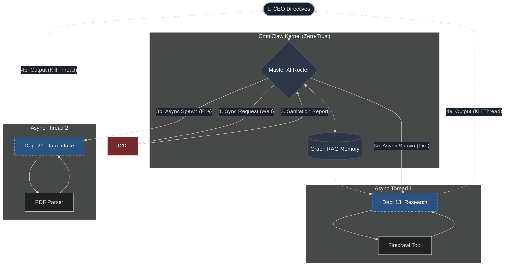

<div align="center">

  
  <h1>🦅 OmniClaw</h1>
  <b>The Autonomous Micro-Syndicate</b><br>
  <br>

  [](#)
  [](#)
  [](#)
  [](https://github.com/LongLeo287/OmniClaw/discussions)
  
  <br>
  
  🌐 **Languages:** [🇺🇸 English](README.md) · [🇻🇳 Tiếng Việt](README-vn.md)
  
  <br>

  [About](#-about-omniclaw) •
  [Comparison](#-why-omniclaw-feature-comparison) •
  [Architecture](#-system-architecture) •
  [Orchestration](#-multi-agent-orchestration) •
  [Ecosystem](#-the-syndicate-ecosystem) •
  [Installation](#-quick-start--installation) •
  [Wiki](https://github.com/LongLeo287/OmniClaw/wiki)

</div>

---

## 🌟 About OmniClaw
**OmniClaw** is a highly modular, multi-agent Operating System designed to run directly on top of premier LLMs (Anthropic Claude, Google Gemini, OpenAI). It transforms your local machine into an autonomous digital syndicate. 

Rather than acting as a simple chatbot, OmniClaw actively routes your complex directives through specialized **Functional Departments**, manages its own memory utilizing Graph RAG, and dynamically evolves its codebase based on your instructions. It is designed with **Zero-Trust Privacy**, ensuring all your local data remains strictly on your machine.

---

## ⚔️ Why OmniClaw? (Feature Comparison)

How does OmniClaw stack up against the current AI agent landscape? We built this syndicate to fix the chaos of decentralized agents and the privacy risks of cloud-based IDEs.

| Feature | 🦅 OmniClaw | AutoGPT | CrewAI | Claude Code (Native) |
| :--- | :---: | :---: | :---: | :---: |
| **Monolithic Routing** (Single Boss Agent) | 🟢 Yes | 🔴 No | 🟡 Partial | 🟢 Yes |
| **Zero-Trust Local Sanitization** | 🟢 Built-in | 🔴 No | 🔴 No | 🟡 Manual |
| **Cognitive Memory (Graph RAG)** | 🟢 Built-in | 🟡 Plugin | 🟡 Plugin | 🔴 No |
| **Universal Bootstrapper** | 🟢 Yes | 🔴 No | 🔴 No | 🔴 No |
| **3-Tier Plugin Sandboxing** | 🟢 Strict | 🔴 Chaos | 🟡 Basic | 🔴 No |
| **IDE Agnostic** (Cursor, VSCode, CLI) | 🟢 Yes | 🟡 CLI only | 🟡 CLI only | 🟡 CLI mostly |

---

## 🏛️ System Architecture

OmniClaw is built on a strict Hub-and-Spoke monolithic design. All requests flow through the Master AI Router, ensuring no rogue agents can execute code without authorization.

<div align="center">

  
  <br><i>Figure 1: The OmniClaw Zero-Trust Monolithic Architecture</i>

</div>

---

## 🧠 Multi-Agent Orchestration

OmniClaw prevents "Agent Chaos" by enforcing a strict communication model. Agents do not chat with each other directly; they only communicate through the central Master AI Router or by reading/writing to the shared Cognitive Memory (Graph RAG).


<div align="center">
  <i>Figure 2: OmniClaw Monolithic Syndicate Orchestration Flow</i>
</div>
<br>

### Delegation Modes

| Mode | How it works | Best for |
| :--- | :--- | :--- |
| **Sync (Wait)** | Master Router delegates to a Dept and halts until the exact output is returned. | Quick lookups, Security Audits (Dept 10), Syntax checks. |
| **Async (Fire & Forget)** | Master Router delegates a background thread to a Dept and continues its own execution. | Massive PDF ingestion (Dept 20), Deep Web scraping (Dept 13). |

### The Syndicate Workflow

Unlike standard multi-agent frameworks where agents chat endlessly with each other, OmniClaw forces a structured corporate workflow:
* **Shared Cognitive Memory (Graph RAG):** Departments do not chat freely. They inject and retrieve structured Knowledge Items (KIs) via the central Graph Database.
* **Zero-Trust Handoffs:** Payloads passed between Departments are strictly sanitized. For example, Dept 20 crushes heavy PDFs into pure Markdown before Dept 13 is allowed to analyze them, preventing malicious code execution.
* **Hardware-Level Locks:** Only Dept 22 (Operations) has permission to execute shell commands or run Git operations. All other agents are strictly sandboxed.

### 3-Tier Plugin Protocol
To maintain a lightweight footprint while offering infinite vertical scaling, all tools in OmniClaw follow a strict **3-Tier Plugin Protocol**:
*   **Tier 1 (Core Infrastructure)**: Native, always-on engines (e.g., `LightRAG`, `Firecrawl`).
*   **Tier 2 (Lazy-Load Plugins)**: Specialized tools that are sandboxed and **spun up only when requested**, then autonomously destroyed to free up RAM.
*   **Tier 3 (Blacklisted)**: Outdated or conflicting legacy modules (Strictly forbidden).

---

## 🏢 The Syndicate Ecosystem

Directives from the CEO (You) are routed through our built-in workforce. OmniClaw operates **21 specialized departments**. Below is a snapshot of our core active units:

| Dept ID | Category | Function | Permission Level | Head Agent |
| :--- | :--- | :--- | :--- | :--- |
| **Dept 01** | `Engineering` | Scalable Backend, UI/UX, AI integration. | `Local R/W` | `backend-architect` |
| **Dept 10** | `Security` | Zero-Trust Git sweeps, env sanitation. | `Root Local` | `strix-agent` |
| **Dept 13** | `Research` | Deep Web scraping, architectural prototyping. | `Web Access` | `rd-lead` |
| **Dept 18** | `Memory` | Managing Memory Rotation & Graph RAG. | `Local Read` | `library-manager` |
| **Dept 20** | `Data Intake` | Parses massive PDFs/URLs into pure Markdown. | `Isolated Sandbox`| `intake-chief` |
| **Dept 22** | `Operations` | Hardware sanitation, root cleanup, Git Force-Push. | `Root Local` | `scrum-master` |

> [!TIP]
> **Deep Dive**: To view the full roster of all 21 departments and tool permissions, securely access our **[Master System Index on Wiki](https://github.com/LongLeo287/OmniClaw/wiki)**.

---

## ⚡ Quick Start & Installation

OmniClaw provides a Universal Bootstrapper. Choose the method that best fits your workflow.

### Method A: Global Installation (Recommended)
Best for users who want to summon OmniClaw from any directory on their machine.

```bash
# 1. Clone the core repository and enter directory
git clone https://github.com/LongLeo287/OmniClaw.git && cd OmniClaw

# 2. Link the Global System via NPM
npm install -g .

# 3. Boot the Syndicate Terminal (Run from anywhere)
omniclaw
```

### Method B: Standalone Portable (Windows / Linux)
Best for isolated, project-specific deployments without altering global paths.

```bash
# 1. Clone the repository and enter directory
git clone https://github.com/LongLeo287/OmniClaw.git && cd OmniClaw

# 2. Run the bootstrapper directly
# On Linux/Mac:
./omniclaw.sh

# On Windows (Or simply double-click the file in Explorer):
omniclaw.bat
```

---

## 📚 Official Wiki & Knowledge Base

All deep-dive technical documentation, standard operating procedures (SOPs), and developer guides are strictly hosted on our GitHub Wiki to keep the root directory pristine.

**[➡️ Enter the OmniClaw Knowledge Base](https://github.com/LongLeo287/OmniClaw/wiki)**

* 🏛️ [Monolithic OS Design](https://github.com/LongLeo287/OmniClaw/wiki/Monolithic-OS-Design)
* 🧠 [Cognitive Memory System (Graph RAG)](https://github.com/LongLeo287/OmniClaw/wiki/Cognitive-Memory)
* 🛡️ [Zero-Trust Model & Deep Cleaning](https://github.com/LongLeo287/OmniClaw/wiki/Zero-Trust-Model)

---

## 🙏 Acknowledgements

OmniClaw stands upon the shoulders of monumental open-source architectures. We deeply thank and credit:

*   **[Anthropic](https://anthropic.com)**: For the Claude Code CLI and its phenomenal REPL structure.
*   **[Google Deepmind](https://deepmind.google.com/technologies/gemini/)**: For the Gemini models and their unprecedented deep-context structural analysis.
*   **[affaan-m / everything-claude-code](https://github.com/affaan-m/everything-claude-code)**: For their cross-platform Agent shielding workflows.
*   **[LightRAG](https://github.com/HKUDS/LightRAG)**: Supplying the precise Graph-based cognitive retrieval system.
*   **[Firecrawl](https://firecrawl.dev)**: Powering the flawless markdown extraction pipeline.
*   **[Mem0](https://github.com/mem0ai/mem0)**: Revolutionizing long-term memory persistence.
*   **[CrewAI](https://crewai.com)**: Inspiring the localized worker-thread hive network.
*   **[Cursor](https://cursor.sh)** / **OpenCode**: Our IDE environments of choice.

<br>
<div align="center">
  <i>"The Operating System of the Future, Running on Your Desk Today."</i>
</div>
