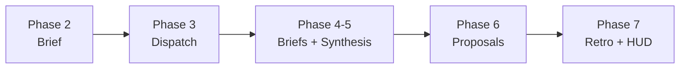

# 🧠 BRAINSTORM — Cycle 12 — 2026-03-25
**Người tạo:** Antigravity | **Phiên:** 2026-03-25T09:54
**Mục đích:** Khám phá 3 hướng đi cho phiên hôm nay — CEO quyết định

---

## Bức tranh tổng thể

```mermaid
mindmap
  root((Cycle 12))
    Track 1 - Proposals
      AOS CLI
      Skill Tier Batch
      Plugin Candidates
      ClawTask Telemetry
      DeepAgents Autostart
    Track 2 - Corp Cycle
      Phase 2 Brief
      Phase 3 Dispatch
      Phase 4-5 Briefs + Synthesis
      Phase 6 Proposals
      Phase 7 Retro
    Track 3 - CIV Feature
      GitHub repo má»›i
      URL bài viết
      Công cụ mới
      Ý tưởng tính năng
```



---

## TRACK 1 — Review 5 Proposals

> **Câu hỏi cốt lõi:** Cái nào tạo ra giá trị nhất cho hệ thống hôm nay?

### P1 — AOS CLI (`ops/aos.py`)
```
Vấn đề: "aos corp start" chỉ là từ trong workflow — không có code thực
Nếu build: CEO gõ 1 lệnh → hệ thống tự chạy hết các phases
Nếu không: CEO vẫn điều phối thủ công qua Antigravity (hiện tại)

❓ CEO có muốn corp cycle tự động hóa hoàn toàn không?
❓ Hay vẫn muốn giữ kiểm soát từng phase?
```

### P2 — Skill Tier Batch (`fix_skill_tiers.py`)
```
Vấn đề: 2618/2795 skills thiếu tier metadata → routing agent đang đoán mò
Nếu fix: Agent biết dùng skill nào theo tier → boot nhanh hơn, chính xác hơn
Nếu không: Hệ thống vẫn chạy được nhưng kém tối ưu

❓ CEO thấy có vấn đề với skill routing hiện tại không?
```

### P3 — Plugin Candidates
```
VieNeu TTS: Vietnamese voice output — nếu CEO muốn nghe báo cáo thay vì đọc
ag-auto-click-scroll: VS Code ext tự click Antigravity — tiết kiệm thao tác

❓ CEO có dùng voice assistant không?
❓ Workflow VS Code của CEO như thế nào?
```

### P4 — ClawTask Telemetry | P5 — DeepAgents Autostart
```
Cả 2 phụ thuộc ClawTask — CEO đã nói không dùng ClawTask phiên này
→ Naturally defer cho đến khi ClawTask được activate lại
```

---

## TRACK 2 — Corp Cycle Phase 2-7

> **Câu hỏi cốt lõi:** Hôm nay AI OS Corp cần "làm việc" hay "review"?



### 3 scenario chạy cycle hôm nay:

**Scenario A — Full Cycle (có task mới)**
```
CEO cần có task backlog cho 21 depts
Mỗi dept nhận 1-3 task cụ thể → thực thi → nộp brief
Phù hợp khi: CEO có dự án đang chạy, có deliverable cần làm
```

**Scenario B — Mini-Cycle (review + retro)**
```
Chỉ chạy: Phase 1 + Phase 5 (Synthesis) + Phase 7 (Retro)
cognitive_reflector tổng hợp 21 briefs từ Cycle 11
Viết RETRO_2026-03-25.md — bài học, điểm yếu, đề xuất
Phù hợp khi: Không có task mới, muốn review system health
```

**Scenario C — Focused Sprint (1 dept)**
```
CEO chọn 1 dept cụ thể (ví dụ: R&D, Engineering, Registry)
Chạy sâu vào 1 dept thay vì dàn trải 21
Phù hợp khi: Có 1 mục tiêu cụ thể hôm nay
```

---

## TRACK 3 — Feature Mới → CIV Pipeline

> **Câu hỏi cốt lõi:** CEO đang muốn học/tích hợp gì mới?

```mermaid
flowchart TD
    A[CEO paste input] --> B{Loại input?}
    B -->|GitHub repo| C[Clone → Vet 12 stages → Analyze]
    B -->|URL bài viết| D[Crawl → Extract → KI note]
    B -->|Ý tưởng| E[R&D → Experiment → Proposal]
    B -->|Tool/Plugin| F[CIV → Security → Register]
    C --> G[Skill mới hoặc REJECT]
    D --> H[brain/knowledge/notes/]
    E --> I[PROP_*.md cho CEO]
    F --> J[storage/vault/plugins/ + registry]
```



**Loại input CEO hay paste nhất:**
- Research paper / blog kỹ thuật → thành knowledge item
- GitHub repo hay → thành skill hoặc plugin
- Công cụ AI mới → vào storage/vault/llm hoặc storage/vault/plugins
- Ý tưởng tính năng cho dự án → R&D experiment

---

## 🗺️ Ma trận quyết định hôm nay

| | Nhanh (<2h) | Tạo giá trị dài hạn | Cần CEO input |
|---|---|---|---|
| **P1 AOS CLI** | ❌ 3h | ✅ cao | ✅ |
| **P2 Skill Tier** | ✅ 2h | ✅ cao | ❌ auto |
| **Mini-Cycle Retro** | ✅ 1h | ✅ medium | ❌ auto |
| **CIV Feature mới** | ✅ 30min | 🔄 depends | ✅ cần link |
| **Full Cycle** | ❌ 3-4h | ✅ cao | ✅ cần taskset |

---

## Câu hỏi để CEO trả lời

```
1. Hôm nay CEO có task cụ thể nào muốn các dept thực hiện không?
   → Có: Full Cycle | Không: Mini-Cycle

2. CEO có muốn AOS CLI (gõ 1 lệnh chạy hệ thống) không?
   → Có: Approve P1, build hôm nay | Không: Defer

3. CEO muốn intake tool/repo/bài viết nào không?
   → Có: Paste link → CIV start

4. CEO muốn thấy kết quả gì vào cuối phiên hôm nay?
   → Retro? New skill? New knowledge? New feature?
```

---

*Brainstorm v1.0 | Cycle 12 | 2026-03-25*
*LÆ°u: brain/knowledge/notes/BRAINSTORM_2026-03-25_CYCLE12.md*

