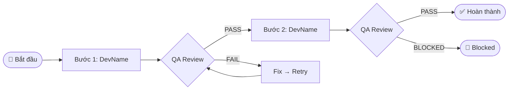

# report_prompt.md — Mẫu Báo Cáo Mermaid (Phase 6)
# Authority: Tier 2 | Dùng bởi: Antigravity (Phase 6 — REPORT)

## Hướng Dẫn

Sau khi đọc blackboard.json + receipts từ Claude Code,
Antigravity dùng template này tạo báo cáo cho người dùng.
Ngôn ngữ: TIẾNG VIỆT. Gửi dạng Mermaid walkthrough.

---

## Cấu Trúc Báo Cáo (Bắt Buộc)

### Tiêu Đề
```
## Báo cáo: [Tên task — từ blackboard.json]
📅 Hoàn thành: [timestamp]
```

### Tổng Quan
[1-2 câu tóm tắt kết quả: làm gì, kết quả ra sao]

### Luồng Thực Thi


### Kết Quả Chi Tiết

| Bước | Vai trò | Kết quả | File thay đổi |
|------|---------|---------|---------------|
| 1 | DEVELOPER | ✅ PASS | path/to/file.ts |
| 2 | QA | ✅ PASS | — |
| 3 | DEVELOPER | ⚠️ PARTIAL | path/to/file2.ts |

### Bài Học Rút Ra
[Từ cognitive_reflector — max 3 điểm]
- 💡 [bài học 1]
- 💡 [bài học 2]

### Tiếp Theo
[Hành động khuyến nghị — từ open_items]
- [ ] [việc cần làm tiếp theo]

---

*Bạn có muốn đi vào chi tiết bước nào không?*
