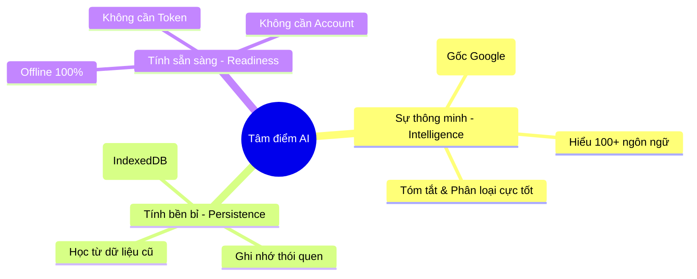

# 🧠 AI Deep Dive: Sự thông minh và Tính "Bền bỉ"

Chào bạn, đây là bản phân tích chi tiết để bạn thấy rõ sức mạnh thực sự của hệ thống AI chúng ta sắp xây dựng.

## 🗺️ Bản đồ Khả năng AI (Mindmap)



---

## 🎠 Giải đáp trực tiếp (Carousel)

````carousel
### 👤 1. Đăng nhập Google có dùng được Gemini Free?
**"Có, nhưng chúng ta còn làm tốt hơn thế"**
*   **Gemini Online:** Nếu bạn login, bạn có thể dùng Gemini qua API (thường có giới hạn free).
*   **Gemini Nano (Lựa chọn của chúng ta):** Đây là AI tích hợp sâu vào Chrome. Bạn không cần login vẫn dùng được. Việc login chỉ giúp đồng bộ dữ liệu bookmark của bạn nhanh hơn, không ảnh hưởng đến "trí thông minh" của AI.
<!-- slide -->
### 🧠 2. AI Local có "thông minh" không?
**"Thông minh đúng việc, đúng chỗ"**
*   **Thực tế:** Nó không thể viết code phức tạp như Gemini 1.5 Pro, nhưng để **hiểu nội dung web, tóm tắt ý chính và gợi ý thư mục** thì nó thực hiện cực kỳ xuất sắc.
*   **Ưu điểm:** Tốc độ phản hồi tính bằng mili giây, không có độ trễ mạng.
<!-- slide -->
### 💾 3. Có lưu trữ "Brain" khi Offline không?
**"Càng dùng càng khôn"**
*   **Cơ chế:** Chúng ta xây dựng một tệp "Bộ não" (Local Brain) trong IndexedDB. Mỗi lần bạn Bookmark, AI sẽ học thêm về sở thích của bạn.
*   **Offline:** Vì mô hình AI và dữ liệu "Brain" đều nằm trên máy bạn, nên khi offline nó **vẫn thông minh 100%** như khi online.
````

---

## 📊 So sánh Trực quan

| Đặc điểm | Gemini Online (Cần Account) | Gemini Nano Local (Phase 10) |
| :--- | :--- | :--- |
| **Độ thông minh tổng quát** | Rất cao (Hàn lâm) | **Khá cao (Thực dụng)** |
| **Tốc độ** | Chờ Server phản hồi | **Tức thì (Real-time)** |
| **Khi mất mạng** | Ngừng hoạt động | **Vẫn chạy bình thường** |
| **Dữ liệu Brain** | Lưu trên mây (Cloud) | **Lưu tại máy bạn (Private)** |

---

**Kết luận:** Chúng ta đang xây dựng một **"Trợ lý thực thụ"** chứ không phải một công cụ chat đơn thuần. Nó sẽ sống, học hỏi và làm việc ngay trong lòng trình duyệt của bạn.

Sau khi nghe giải thích về "Bộ não" này, bạn đã sẵn sàng để chúng ta bắt đầu xây dựng tính năng đầu tiên chưa? 🚀🤖✨🏆🏁🛡️🔍 Bridge BRIDGE!
