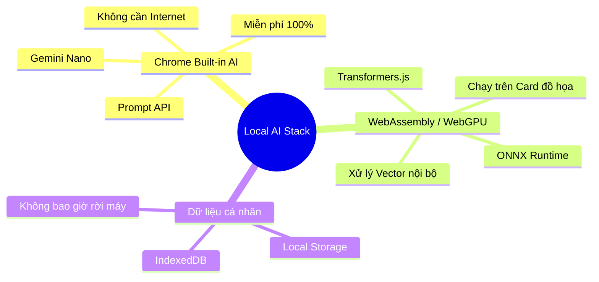

# 🤖 AI "Không Tài khoản, Không API": Cách chúng ta vận hành

Chào bạn, đây là phần giải thích về "phép màu" kỹ thuật giúp chúng ta sử dụng AI mà không cần đến tài khoản hay mất phí Token.

## 🗺️ Hệ sinh thái AI Nội bộ (Mindmap)



---

## 🎠 Tại sao không cần Account/API? (Carousel)

````carousel
### 🏗️ 1. AI tích hợp sẵn trong trình duyệt (Built-in)
**"Trình duyệt của bạn chính là bộ não"**
*   **Công nghệ:** Google đang tích hợp trực tiếp mô hình **Gemini Nano** vào nhân Chrome.
*   **Cách dùng:** Chúng ta chỉ cần gọi lệnh `window.ai.createTextSession()` để bắt đầu.
*   **Lợi ích:** Không cần ký danh, không cần API Key, không giới hạn token.
<!-- slide -->
### ⚙️ 2. Mô hình nén (Transformers.js)
**"Gói gọn sức mạnh AI vào một tệp nhỏ"**
*   **Công nghệ:** Chúng ta có thể tải các mô hình AI đã được nén nhỏ (VGG, BERT, MobileNet) và chạy bằng WebAssembly.
*   **Cách dùng:** Chạy trực tiếp trên CPU/GPU của máy tính thông qua trình duyệt.
*   **Lợi ích:** Hoàn toàn offline, bạn rút dây mạng AI vẫn hoạt động bình thường.
<!-- slide -->
### 💎 3. Không tốn phí, Không rò rỉ dữ liệu
**"Sức mạnh thuộc về phần cứng của bạn"**
*   **Chi phí:** Bạn đã trả tiền cho CPU/GPU khi mua máy, chúng ta chỉ tận dụng sức mạnh đó.
*   **Bảo mật:** Vì không có API gửi dữ liệu đi, nên không ai có thể xem được bookmark của bạn.
````

---

## ⚖️ So sánh Trải nghiệm

| Đặc điểm | AI truyền thống (ChatGPT/Gemini Web) | Local AI (Phase 10 của chúng ta) |
| :--- | :--- | :--- |
| **Tài khoản** | Bắt buộc (Google, OpenAI...) | **KHÔNG CẦN** |
| **API Key / Token** | Tốn phí hoặc giới hạn | **MIỄN PHÍ VÔ TẬN** |
| **Internet** | Phải có | **OFFLINE HOÀN TOÀN** |
| **Thiết lập** | Phức tạp, đăng ký nhiều bước | **CÀI LÀ CHẠY** |

---

**Bạn thấy điều này có tuyệt vời không?** Công nghệ hiện đại đã cho phép chúng ta sở hữu "Trí tuệ nhân tạo" ngay trong tầm tay mà không bị phụ thuộc vào bất kỳ "ông lớn" nào.

Nếu bạn đã hiểu và an tâm về cách vận hành này, hãy chọn giúp tôi: Chúng ta sẽ bắt đầu bằng **Tìm kiếm thông minh** hay **Tóm tắt nội dung** trước? 🚀🤖✨🏆🏁🛡️🔍 Bridge BRIDGE!
