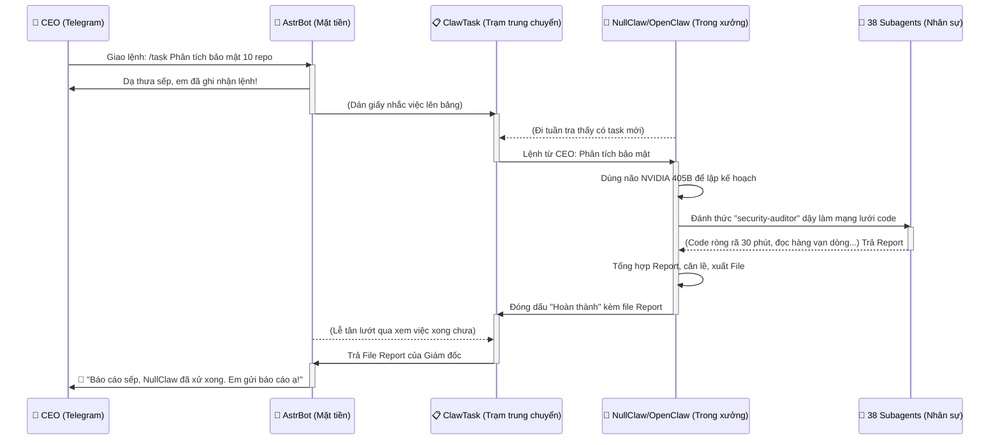

# AI OS CORP - KẾN TRÚC NHÂN SỰ VÀ LUỒNG XỬ LÝ TELEGRAM BOT

Tài liệu này mô tả chi tiết quy trình vận hành tự động và bán tự động của hệ sinh thái AI OS thông qua giao diện Telegram Bot.

## 1. Sơ Đồ Khối Chuỗi Cung Ứng Nhân Sự

## 2. Giải Thích 4 Vai Trò Cốt Lõi

1. **AstrBot (Mặt Tiền / Lễ Tân):**
   - Tiếp nhận lệnh trực tiếp từ CEO qua Telegram.
   - Giao tiếp thân thiện, xử lý các câu hỏi đóng/nhỏ độc lập.
   - Với các Task tốn thời gian, AstrBot đóng vai trò nhận đôn đốc và chuyển giao xuống xưởng.

2. **ClawTask (Trạm Trung Chuyển / Hàng Đợi):**
   - API Queue Service / Database dùng để chứa các Task.
   - Giúp tách biệt nhóm Mặt Tiền và Xưởng Code, đảm bảo không rớt mạng, không mất Task.

3. **NullClaw / OpenClaw (Giám Đốc Xưởng / Orchestrator):**
   - Chạy ngầm (Headless) trong môi trường phân lập.
   - Cốt lõi của hệ thống Auto-Agent.
   - Sử dụng não bộ siêu lớn (NVIDIA Llama 3.1 405B kết hợp 9Router) để lên kế hoạch execution (tốn kém hàng triệu token nhưng đã được cấu hình Free).
   - Tự động gọi, đánh thức và phân công việc cho 38 Subagents.

4. **38 Subagents (Nhân Sự Chuyên Môn):**
   - Đặt tại `workforce/subagents/`.
   - Bao gồm các chuyên gia hẹp: `code-reviewer`, `security-auditor`, `data-analyst`, v.v.
   - Thực thi tác vụ cụ thể theo lệnh của NullClaw.

## 3. Lợi Ích Của Mô Hình
- **Tiết kiệm chi phí 100%:** Khâu tiêu tốn token API nhiều nhất là (3) và (4), đã được giải quyết bằng NVIDIA NIM miễn phí.
- **Hoạt động 24/7:** Kiến trúc tách rời (Decoupled) giúp CEO có thể quăng lệnh và đi ngủ, hệ thống sẽ tự code, tự check lỗi, tự báo cáo qua Telegram khi xong (vào sáng hôm sau).
