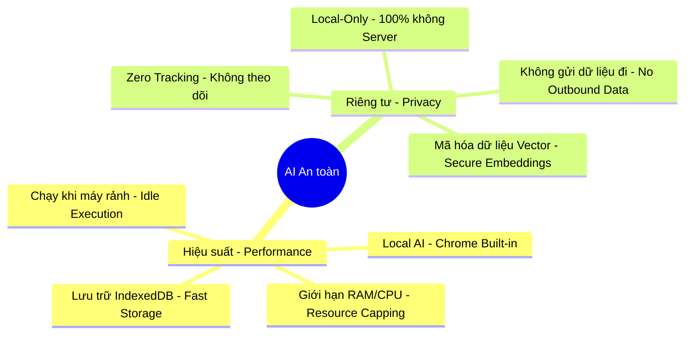

# 🛡️ Chiến lược AI An toàn & Hiệu suất (Phase 10)

Đây là bản cam kết kỹ thuật của tôi (Kiến trúc sư trưởng) để đảm bảo hệ thống AI không biến Extension thành một "gánh nặng" cho trình duyệt của bạn.

## 🗺️ Cách AI vận hành "Êm ái" (Mindmap)



---

## 🎠 Giải đáp các mối lo ngại (Carousel)

````carousel
### 🚀 1. Trình duyệt có bị chậm (Lag) không?
**"AI chỉ chạy khi bạn không làm gì"**
*   **Chiến lược:** Sử dụng `requestIdleCallback`. AI chỉ tiến hành tóm tắt hoặc đánh chỉ mục khi bạn không thao tác chuột/phím hoặc khi CPU đang rảnh.
*   **Hệ quả:** Extension sẽ không bao giờ tranh giành tài nguyên với các tab công việc bạn đang mở.
<!-- slide -->
### 🧠 2. RAM có tăng đột biến không?
**"Sử dụng trí tuệ có sẵn của Chrome"**
*   **Chiến lược:** Ưu tiên dùng **Gemini Nano** (có sẵn trong nhân Chrome). Không cần tải thêm mô hình AI nặng hàng GB vào RAM.
*   **Hệ quả:** Mức tiêu thụ RAM chỉ tương đương với một Extension thông thường, không phải một ứng dụng AI nặng nề.
<!-- slide -->
### 🔒 3. Quyền riêng tư của tôi thì sao?
**"Dữ liệu của bạn là của bạn - Vĩnh viễn"**
*   **Chiến lược:** 100% Local. Toàn bộ quá trình quét nội dung, tạo tóm tắt và Vector đều diễn ra trong máy tính của bạn.
*   **Kiểm chứng:** Không cần API Key, không có bất kỳ kết nối mạng nào được phép gửi dữ liệu bookmark ra ngoài.
````

---

## ⚖️ Bảng so sánh "Hệ thông AI cũ" vs "AI OS Phase 10"

| Đặc điểm | AI truyền thống | AI OS Phase 10 (Của chúng ta) |
| :--- | :--- | :--- |
| **Gửi dữ liệu lên Server** | Cần thiết (OpenAI, Anthropic...) | **KHÔNG** (100% Local) |
| **Phí duy trì** | Trả tiền hàng tháng | **MIỄN PHÍ** (Dùng tài nguyên máy) |
| **Tốc độ** | Phụ thuộc internet | **TỨC THÌ** (Xử lý nội bộ) |
| **Tác động trình duyệt** | Có thể gây treo/lag | **THÔNG MINH** (Chỉ chạy khi máy rảnh) |

---

**Bạn có đồng ý với chiến lược "An toàn là trên hết" này không?** Nếu bạn gật đầu, tôi sẽ khóa các quy tắc này vào `agent_behavior.md` trước khi bắt đầu viết code thực tế.
